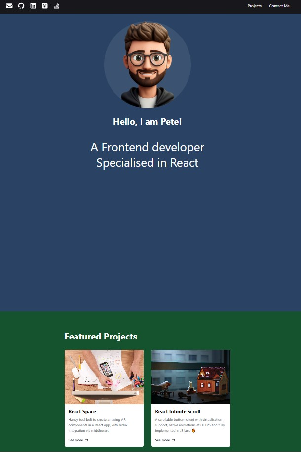

# React Portfolio Exercise

A modern, single-page portfolio application built with React, Chakra UI, Formik, and Yup. This project demonstrates best practices in React development, component-based architecture, and user experience design. It is ideal for showcasing your work, skills, and providing a way for visitors to contact you.

---

## Table of Contents
- [Overview](#overview)
- [Screenshots](#screenshots)
- [Features](#features)
- [Tech Stack](#tech-stack)
- [Getting Started](#getting-started)
- [Project Structure](#project-structure)
- [Usage](#usage)
- [Contributing](#contributing)
- [Credits](#credits)
- [License](#license)

---

## Overview

This portfolio app is designed to be visually appealing, responsive, and easy to customize. It includes:
- A header with social media links and smooth navigation
- A landing section with an avatar and a short introduction
- A featured projects section with project cards
- A contact form with validation and feedback alerts
- A footer with copyright

---

## Screenshots



See the `screenshots/` folder for more UI examples.

---

## Features

- **Header**: Displays social media icons (email, GitHub, LinkedIn, YouTube) and navigation links to Projects and Contact Me sections. Navigation is smooth-scrolling and updates the URL hash.
- **Landing Section**: Shows an avatar, a greeting, and a brief bio (e.g., "Hello, I am Pete! A Frontend developer Specialised in React").
- **Projects Section**: Features a grid of project cards, each with an image, title, description, and a "See more" link. Project data is easily extendable.
- **Contact Me Section**: Contains a form with fields for name, email, type of enquiry, and message. Form validation is handled with Formik and Yup. Alerts provide feedback on submission success or error.
- **Footer**: Simple footer with the author's name and copyright.
- **Responsive Design**: Layout adapts to different screen sizes.
- **Modern UI**: Built with Chakra UI for consistent, accessible, and attractive components.

---

## Tech Stack

- [React](https://react.dev/) – Frontend library
- [Chakra UI](https://chakra-ui.com/) – UI component library
- [Formik](https://formik.org/) – Form state management
- [Yup](https://github.com/jquense/yup) – Form validation
- [Vite](https://vitejs.dev/) – Development/build tool

---

## Getting Started

1. **Clone the repository**
   ```bash
   git clone <your-repo-url>
   cd React-Portfolio-Exercise
   ```
2. **Install dependencies**
   ```bash
   npm install
   ```
3. **Start the development server**
   ```bash
   npm run dev
   ```
4. **Open the app**
   Visit [http://localhost:5173](http://localhost:5173) in your browser.

---

## Project Structure

- `src/components/` – All React components (Header, LandingSection, ProjectsSection, ContactMeSection, Footer, Card, Alert, FullScreenSection)
- `src/context/` – React context for global alert system
- `src/hooks/` – Custom hooks (e.g., `useSubmit` for form submission)
- `src/images/` – Image assets for avatar and projects
- `public/` – Static files and icons
- `screenshots/` – UI screenshots for documentation

---

## Usage

- **Customizing Projects**: Edit the `projects` array in `src/components/ProjectsSection.jsx` to add or update your featured projects.
- **Changing Bio/Avatar**: Update the variables in `src/components/LandingSection.jsx` and replace the avatar image in `src/images/`.
- **Social Links**: Update the `socials` array in `src/components/Header.jsx` with your own URLs and icons.
- **Form Handling**: The contact form uses Formik and Yup for validation. Submission feedback is handled via a custom alert context.

---

## Contributing

Contributions are welcome! To contribute:
1. Fork the repository
2. Create a new branch (`git checkout -b feature/your-feature`)
3. Commit your changes (`git commit -m 'Add some feature'`)
4. Push to the branch (`git push origin feature/your-feature`)
5. Open a pull request

---

## Credits

- [Chakra UI](https://chakra-ui.com/)
- [Formik](https://formik.org/)
- [Yup](https://github.com/jquense/yup)
- [Vite](https://vitejs.dev/)
- [FontAwesome](https://fontawesome.com/) for icons

---

## License

MIT (add your own if needed)
